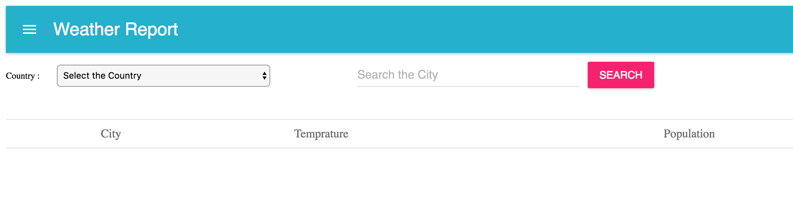

# React-WeatherReport
# Clone the Repo 
run in the server in CMD "yarn run dev-server" in local host "http://localhost:8080/" you will get the page

# Weather report accross the Globe. 

select the country first 
Enter the City for the corresponding country
City name shows as Google map
Temprature shows in SVG Chart
Average Minimum and Maximum Temprature calcultaed.
Total Population shows for the city
