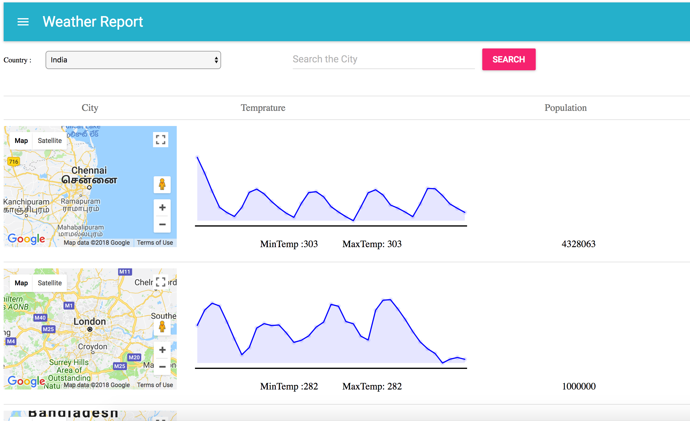

# Global-WeatherReport
# Clone the Repo 
https://github.com/pskvenkat/React-WeatherReport.git

run in the server in CMD "yarn run dev-server" in local host "http://localhost:8080/" you will get the page

# Steps to get Weather Report

1. select the country first 

2. Enter the City for the corresponding country

# Result

City name shows as in Google map

Temprature shows in SVG Chart

Average Minimum and Maximum Temprature calcultaed.

Total Population shows for the city

